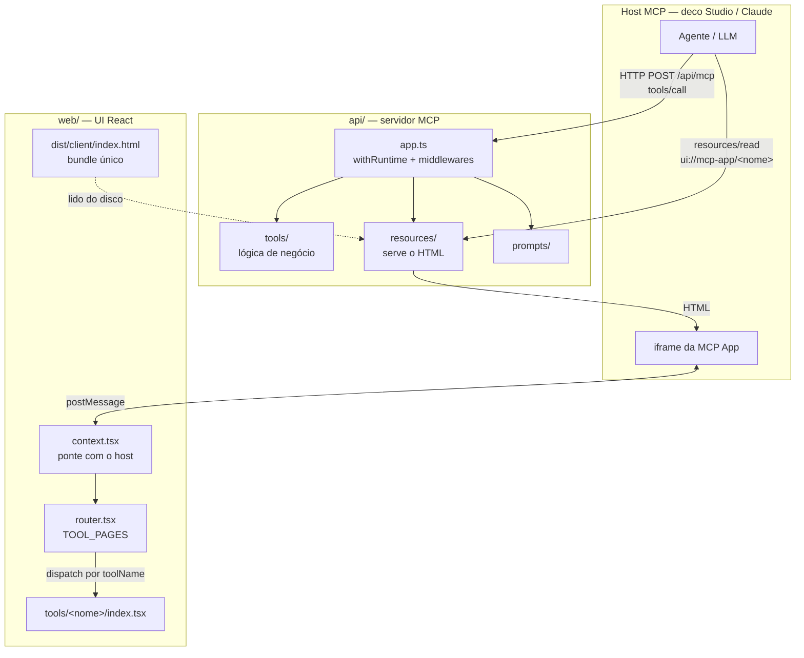
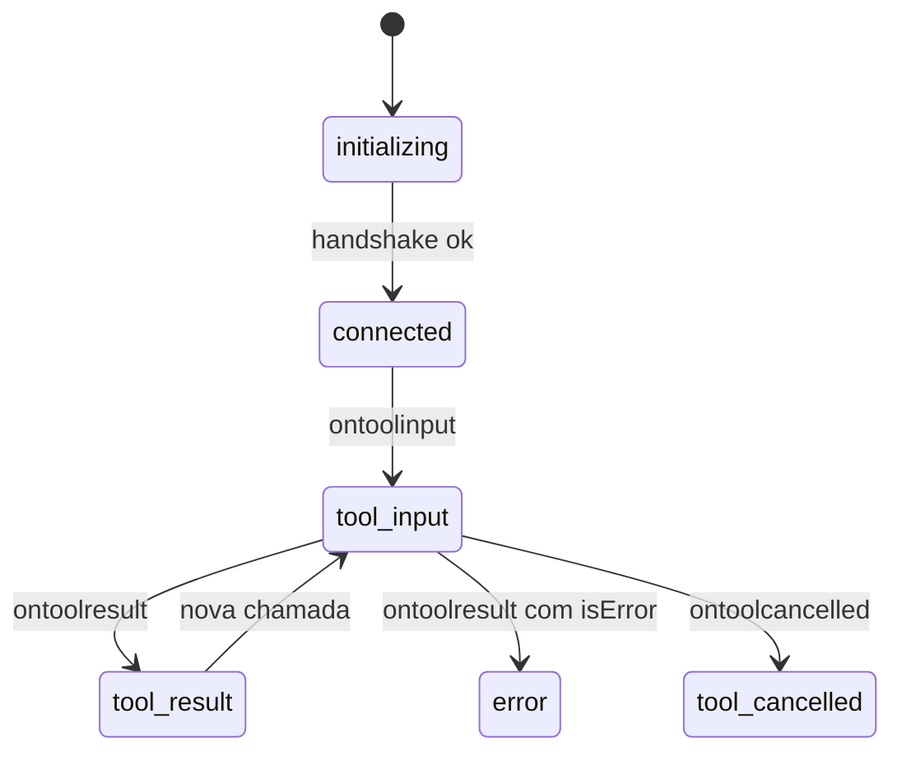

# Arquitetura

Este projeto é um **MCP App**: um servidor MCP (`api/`) que expõe tools, prompts e resources, mais uma UI React (`web/`) que o host MCP renderiza dentro de um iframe.

O ponto mais importante — e o mais contraintuitivo — é:

> **A UI não chama a API.** Não existe cliente RPC neste template.

Quem chama a tool é o **host MCP** (deco Studio, Claude, qualquer cliente MCP). O host executa a tool no servidor e depois *empurra* o input e o resultado para a UI via `postMessage`. A UI é um consumidor passivo de eventos: ela reage a `ontoolinput` / `ontoolresult`, ela não dispara requisições.

---

## 1. Visão geral



O fluxo em uma frase: o host lê o resource `ui://mcp-app/<nome>` para obter o HTML, monta o iframe, executa a tool no servidor e transmite o resultado para dentro do iframe.

---

## 2. Estrutura de diretórios

| Caminho | Papel |
|---|---|
| [api/app.ts](api/app.ts) | `withRuntime()` + middlewares `withLogging` e `withMcpApiRoute`. Exporta `app.fetch` (agnóstico de plataforma) |
| [api/main.bun.ts](api/main.bun.ts) | Entrypoint da plataforma — `Bun.serve` na porta 3001 |
| [api/tools/](api/tools/) | Uma tool por arquivo + `index.ts` com o array de registro |
| [api/resources/](api/resources/) | Serve `dist/client/index.html` como recurso MCP |
| [api/prompts/](api/prompts/) | Prompts reutilizáveis expostos ao host |
| [api/types/env.ts](api/types/env.ts) | `StateSchema` (config da app) + tipo `Env` |
| [web/app.tsx](web/app.tsx) | `createRoot` → `<McpProvider><AppRouter/></McpProvider>` |
| [web/context.tsx](web/context.tsx) | Ponte com o host via `useApp()` do `ext-apps` → 3 contextos React |
| [web/router.tsx](web/router.tsx) | Registro `TOOL_PAGES` — dispatch em runtime pelo `toolName` |
| [web/types.ts](web/types.ts) | `McpStatus` / `McpState` — a máquina de estados |
| [web/tools/](web/tools/) | Uma página por tool |
| [web/components/ui/](web/components/ui/) | shadcn/ui (estilo new-york) |

### O build produz um bundle único

`vite build` gera **um** arquivo: `dist/client/index.html`, com CSS e JS inlined (`vite-plugin-singlefile`). Todas as tools compartilham esse mesmo bundle.

Consequência prática: **o roteamento é em runtime, não em build**. Todo resource lê o mesmo `index.html`, e é o [web/router.tsx](web/router.tsx) que decide qual página renderizar, olhando o `toolName` que o host informou. Não existe build por tool, nem variável `TOOL=`, nem um HTML por ferramenta.

---

## 3. Ciclo de vida de uma chamada

```mermaid
sequenceDiagram
    participant H as Host MCP
    participant S as Servidor (api/)
    participant U as UI (iframe)

    H->>S: tools/list
    S-->>H: [hello_world, _meta.ui.resourceUri]

    Note over H: usuário/agente decide chamar a tool

    H->>S: resources/read ui://mcp-app/hello
    S-->>H: text/html;profile=mcp-app
    H->>U: monta iframe com o HTML

    U->>H: useApp() — handshake
    H-->>U: hostContext (toolInfo, tema, safeAreaInsets)
    Note over U: status: connected<br/>toolName = ctx.toolInfo.tool.name

    H->>U: ontoolinput(arguments)
    Note over U: status: tool-input

    H->>S: tools/call hello_world
    S->>S: execute({ context })
    S-->>H: structuredContent

    H->>U: ontoolresult(result)
    Note over U: status: tool-result

    opt Ações de volta para o host
        U->>H: app.sendMessage(...)
        U->>H: app.requestDisplayMode(...)
    end
```

Caminhos alternativos: se o host cancela, dispara `ontoolcancelled`; se a tool retorna `isError`, o [web/context.tsx](web/context.tsx) extrai o primeiro bloco de texto e vira `status: "error"`.

---

## 4. Máquina de estados da UI



Definida em [web/types.ts](web/types.ts):

```ts
export type McpStatus =
	| "initializing"
	| "connected"
	| "tool-input"
	| "tool-result"
	| "tool-cancelled"
	| "error";

export interface McpState<TInput = unknown, TResult = unknown> {
	status: McpStatus;
	toolName?: string;
	error?: string;
	toolInput?: TInput;
	toolResult?: TResult;
}
```

**Toda página precisa tratar os 6 status.** Use isso como checklist.

---

## 5. Receita A — Criar uma API (tool sem UI)

Use quando a tool é uma ação simples: alternar algo, deletar, consultar um valor, disparar um webhook. Se o retorno se beneficia de apresentação visual (listas, gráficos, formulários), pule para a [Receita B](#6-receita-b--criar-uma-web-application-tool-com-ui).

### Passo 1 — Criar `api/tools/<nome-kebab>.ts`

```ts
import { createTool } from "@decocms/runtime/tools";
import { z } from "zod";
import type { Env } from "../types/env.ts";

export const searchUsersInputSchema = z.object({
	query: z.string().describe("Termo de busca"),
	limit: z.number().optional().describe("Máximo de resultados"),
});

export type SearchUsersInput = z.infer<typeof searchUsersInputSchema>;

export const searchUsersOutputSchema = z.object({
	users: z.array(z.object({ id: z.string(), name: z.string() })),
	total: z.number(),
});

export type SearchUsersOutput = z.infer<typeof searchUsersOutputSchema>;

export const searchUsersTool = (_env: Env) =>
	createTool({
		id: "search_users",
		description:
			"Busca usuários por nome ou email. Use quando precisar localizar um usuário antes de agir sobre ele.",
		inputSchema: searchUsersInputSchema,
		outputSchema: searchUsersOutputSchema,
		annotations: {
			readOnlyHint: true,
			destructiveHint: false,
			idempotentHint: true,
			openWorldHint: false,
		},
		execute: async ({ context }) => {
			const { query, limit = 10 } = context;
			// ... sua lógica
			return { users: [], total: 0 };
		},
	});
```

Pontos que importam:

- **Exporte os schemas e os tipos inferidos.** Mesmo sem UI agora, isso é o que dá type-safety ponta a ponta depois.
- **É uma factory**, não uma instância: `(env: Env) => createTool({...})`. O runtime injeta o `env`.
- `execute: async ({ context })` — `context` é o **input já validado** pelo Zod. Não revalide.
- A `description` é lida pelo LLM. Diga o que faz **e quando usar**.
- `annotations` mudam como o cliente MCP trata a tool (se pode chamar sem confirmação, se pode repetir, etc.). Preencha com sinceridade.
- **Sem `_meta`** quando não há UI.

### Passo 2 — Registrar em [api/tools/index.ts](api/tools/index.ts)

```ts
import { helloTool } from "./hello.ts";
import { searchUsersTool } from "./search-users.ts";

export const tools = [helloTool, searchUsersTool];
```

Array de **factories**, não de instâncias — não chame a função aqui.

### Convenções de nome

| Aspecto | Convenção | Exemplo |
|---|---|---|
| ID da tool | `snake_case` | `search_users` |
| Nome do arquivo | `kebab-case` | `search-users.ts` |
| Resource URI | `ui://mcp-app/<kebab>` | `ui://mcp-app/search-users` |
| Exports | `camelCase` | `searchUsersTool`, `searchUsersInputSchema` |

### Verificação

```bash
bun run dev
```

A tool passa a aparecer em `http://localhost:3001/api/mcp`.

---

## 6. Receita B — Criar uma web application (tool com UI)

Faça os passos 1 e 2 acima, e depois:

### Passo 3 — Declarar o resource URI na tool

No mesmo arquivo `api/tools/search-users.ts`:

```ts
export const SEARCH_USERS_RESOURCE_URI = "ui://mcp-app/search-users";

export const searchUsersTool = (_env: Env) =>
	createTool({
		id: "search_users",
		// ...
		_meta: { ui: { resourceUri: SEARCH_USERS_RESOURCE_URI } },
		// ...
	});
```

É o `_meta.ui.resourceUri` que diz ao host "esta tool tem interface, vá buscar aqui".

### Passo 4 — Criar `api/resources/<nome-kebab>.ts`

```ts
import { readFile } from "node:fs/promises";
import { join } from "node:path";
import { createPublicResource } from "@decocms/runtime/tools";
import { SEARCH_USERS_RESOURCE_URI } from "../tools/search-users.ts";
import type { Env } from "../types/env.ts";

const RESOURCE_MIME_TYPE = "text/html;profile=mcp-app";

function getDistPath(): string {
	const projectRoot = join(import.meta.dir, "../..");
	return join(projectRoot, "dist", "client", "index.html");
}

export const searchUsersAppResource = (_env: Env) =>
	createPublicResource({
		uri: SEARCH_USERS_RESOURCE_URI,
		name: "Search Users UI",
		description: "Interface de busca de usuários",
		mimeType: RESOURCE_MIME_TYPE,
		read: async () => {
			const html = await readFile(getDistPath(), "utf-8");
			return {
				uri: SEARCH_USERS_RESOURCE_URI,
				mimeType: RESOURCE_MIME_TYPE,
				text: html,
			};
		},
	});
```

Atenção:

- O MIME precisa ser **exatamente** `"text/html;profile=mcp-app"`. Qualquer variação e o host não reconhece como MCP App.
- Lê `dist/client/index.html` — o bundle compartilhado. Não existe HTML por tool.
- **Importe** o URI do arquivo da tool. Nunca redefina a string aqui: as duas cópias vão divergir.

### Passo 5 — Registrar o resource em [api/app.ts](api/app.ts)

```ts
import { helloAppResource } from "./resources/hello.ts";
import { searchUsersAppResource } from "./resources/search-users.ts";

const runtime = withRuntime<Env, typeof StateSchema>({
	configuration: { state: StateSchema },
	tools,
	prompts,
	resources: [helloAppResource, searchUsersAppResource],
});
```

Esquecer este passo é silencioso e confuso: **a tool funciona, mas a UI nunca carrega.**

### Passo 6 — Criar `web/tools/<nome>/index.tsx`

```tsx
import { Card, CardContent, CardHeader, CardTitle } from "@/components/ui/card.tsx";
import { useMcpApp, useMcpState } from "@/context.tsx";
import type {
	SearchUsersInput,
	SearchUsersOutput,
} from "../../../api/tools/search-users.ts";

export default function SearchUsersPage() {
	const state = useMcpState<SearchUsersInput, SearchUsersOutput>();
	const app = useMcpApp();

	if (state.status === "initializing") {
		return <div className="p-6 text-muted-foreground">Conectando ao host...</div>;
	}

	if (state.status === "connected") {
		return <div className="p-6 text-muted-foreground">Aguardando chamada da tool...</div>;
	}

	if (state.status === "error") {
		return <div className="p-6 text-destructive">{state.error ?? "Erro desconhecido"}</div>;
	}

	if (state.status === "tool-cancelled") {
		return <div className="p-6 text-destructive">Chamada cancelada.</div>;
	}

	if (state.status === "tool-input") {
		return <div className="p-6">Buscando "{state.toolInput?.query}"...</div>;
	}

	// tool-result
	return (
		<Card className="m-6">
			<CardHeader>
				<CardTitle>{state.toolResult?.total} usuários</CardTitle>
			</CardHeader>
			<CardContent>
				{state.toolResult?.users.map((u) => (
					<p key={u.id}>{u.name}</p>
				))}
			</CardContent>
		</Card>
	);
}
```

Pontos que importam:

- **Default export obrigatório** — é assim que o router importa.
- `useMcpState<Input, Output>()` com os tipos importados **direto do arquivo do servidor**. Isso dá type-safety ponta a ponta sem nenhum codegen: mudou o schema da tool, o TypeScript acusa na UI.
- O import de `api/` pode usar o alias `@` (`@/api/tools/...`) ou caminho relativo (`../../../api/...`) — o alias cobre a raiz do projeto inteira, não só `web/`.
- Trate os 6 status.

### Passo 7 — Registrar em `TOOL_PAGES` ([web/router.tsx](web/router.tsx))

```tsx
import HelloPage from "./tools/hello/index.tsx";
import SearchUsersPage from "./tools/search-users/index.tsx";

const TOOL_PAGES: Record<string, React.ComponentType> = {
	hello_world: HelloPage,
	search_users: SearchUsersPage,
};
```

**A chave tem que ser igual ao `id` da tool** (`search_users`, não `search-users` nem `searchUsers`). Errar aqui produz o erro `Unknown tool: X` na tela — é o esquecimento mais comum.

### Passo 8 (opcional) — Falar de volta com o host

O objeto `app` de `useMcpApp()` expõe as ações de saída:

```tsx
// alternar entre inline e tela cheia
await app?.requestDisplayMode({ mode: "fullscreen" });

// injetar uma mensagem na conversa do agente
app?.sendMessage({
	role: "user",
	content: [{ type: "text", text: "Detalhe o usuário 42 para mim." }],
});
```

Exemplo completo em [web/tools/hello/index.tsx](web/tools/hello/index.tsx).

### Checklist da Receita B

- [ ] `api/tools/<nome>.ts` com schemas exportados + `_meta.ui.resourceUri`
- [ ] tool no array de [api/tools/index.ts](api/tools/index.ts)
- [ ] `api/resources/<nome>.ts` com MIME `text/html;profile=mcp-app`
- [ ] resource no array `resources` de [api/app.ts](api/app.ts)
- [ ] `web/tools/<nome>/index.tsx` com default export e os 6 status
- [ ] entrada em `TOOL_PAGES` com a chave = `id` da tool

---

## 7. Bônus — Prompts

Além de tools e resources, o servidor expõe prompts: atalhos que o usuário aciona no host e que viram mensagens prontas para o agente.

```ts
import { createPublicPrompt } from "@decocms/runtime/tools";

export const searchUsersPrompt = (_env: Env) =>
	createPublicPrompt({
		name: "search-users",
		title: "Buscar usuários",
		description: "Localiza usuários pelo nome",
		argsSchema: { query: z.string().describe("Termo de busca") },
		execute: async ({ args }) => ({
			messages: [
				{
					role: "user" as const,
					content: {
						type: "text" as const,
						text: `Use a tool search_users para buscar "${args.query}".`,
					},
				},
			],
		}),
	});
```

Registre em `api/prompts/index.ts`, mesmo padrão de array das tools.

---

## 8. Regras de estilo e armadilhas

- **Imports precisam de extensão**: `./hello.ts`, `./index.tsx`. O Biome trata `useImportExtensions` como `error`.
- **Alias `@` → raiz do projeto** (não só `web/`) — `@/web/...` ou `@/api/...`.
- **Tabs e aspas duplas** — formatação do Biome. Rode `bun run fmt`.
- **[api/app.ts](api/app.ts) nunca importa API específica de plataforma.** Bun, Workers, Deno, Node e Lambda são resolvidos nos entrypoints `api/main.<plataforma>.ts`, que só reexportam `app.fetch`.
- **O endpoint público é `/api/mcp`.** O middleware `withMcpApiRoute` reescreve `/api/mcp*` → `/mcp*` internamente e devolve **404 de propósito** para `/mcp` puro ([api/app.ts:80](api/app.ts#L80)).
- **Tema vem do host.** O Tailwind v4 está mapeado sobre CSS vars fornecidas pelo host (`--color-background-primary`, `--color-text-primary`, …) em [web/globals.css](web/globals.css). Use os tokens do shadcn (`text-muted-foreground`, `border-destructive`, `bg-card`) — cor hardcoded quebra o dark mode do host.
- **`web/` não faz fetch para o servidor.** Se você se pegou escrevendo `fetch("/api/...")` dentro da UI, provavelmente o dado deveria estar no `outputSchema` da tool.

---

## 9. Comandos

| Comando | O que faz |
|---|---|
| `bun run dev` | Sobe API (hot reload) e build do web em watch, em paralelo |
| `bun run dev:api` | Só o servidor MCP — `http://localhost:3001/api/mcp` |
| `bun run dev:web` | Só o `vite build --watch` |
| `bun run build` | Bundle do web + bundle do servidor em `dist/` |
| `bun run check` | `tsc --noEmit` |
| `bun run ci:check` | `biome ci .` (lint + formatação) |
| `bun run fmt` / `bun run lint` | Corrige formatação / lint |
| `bun test` | Testes |
| `bun start` | Sobe o dev e abre um túnel `deco link`, imprimindo a URL pública `/api/mcp` para plugar no deco Studio |

Para testar a UI localmente você precisa de um build do web presente em `dist/client/index.html` — por isso `bun run dev` roda os dois em paralelo. Se a UI não carregar no host, confirme primeiro que esse arquivo existe.
